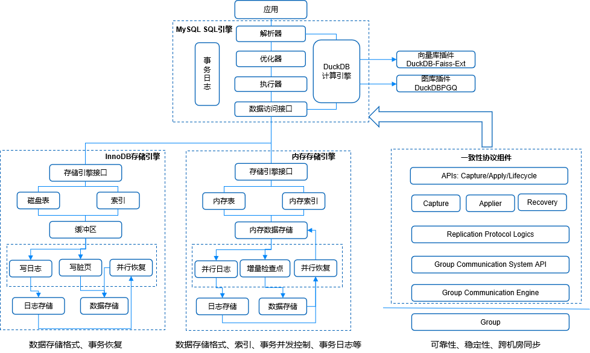

# 多模态内存数据库

## 第一章 产品概述

### 产品介绍

#### 产品定位

LTMDB 是一款多模态内存数据库。它同时搭载了 MySQL 和 DuckDB 的计算引擎，使用 InnoDB 存储引擎，继承了 MySQL 的全部功能和 DuckDB 的绝大部分功能，对 OLAP、OLTP 两种常见的业务模式都能非常快速地进行响应，兼容 MySQL 协议，并且支持 MySQL 和 PG 语法。

LTMDB 同时支持 OLTP（联机事务处理）和 OLAP（联机分析处理）双模工作负载，并且支持了基于 faiss 的向量查询操作。其中，InnoDB 引擎为高并发事务处理提供 ACID 保障，支持每秒数万级事务处理能力；DuckDB 引擎针对复杂分析查询进行深度优化，可实现实时分析响应；向量索引的引入则允许 LTMDB 执行向量相似性搜索，在模糊查询和 AI 推理中有重要的用途。

这种混合架构不仅突破了传统数据库 AP 性能差的技术局限，还通过智能路由机制自动识别负载类型，实现计算资源的最优调度。

### 整体架构

LTMDB 为一个多模态内存数据库，主要分 SQL 引擎计算层和存储层。以 MySQL 8.0.30 为基本架构，集成了 DuckDB 1.2.2，自研了内存存储引擎 LtmDB，支持向量库和图库插件。MySQL 计算引擎和 DuckDB 计算引擎可以分别访问 InnoDB 和 LtmDB，TP 业务走 MySQL 引擎，AP 业务以及向量库、图库业务走 DuckDB 引擎。InnoDB 存储引擎通过 Paxos 协议来保证高可用，而内存引擎 LtmDB 则是使用了多日志流的 Raft 一致性协议。总体架构如下图所示：

## 内存数据库基础

### 内存数据库发展历史

#### 雏形期（1969 年~1984 年）

- **1969 年**：IBM 公司研制了世界上最早的层次数据库管理系统 IMS（Information Management System）。IMS 中的 Fast Path 是一个支持内存驻留数据的商业化数据库，它允许需要频繁访问的数据直接存放在物理内存中，这被视为内存数据库的雏形。
- **1984 年**：DJ DeWitt 等人发表了《主存数据库系统的实现技术》一文，首次提出了 Main Memory Database（主存数据库）的概念，并预言随着内存价格的下降，大容量的数据库将有可能全部保存在内存中。

#### 技术理论成熟期（1985 年~1990 年）

- **1985 年**：IBM 推出了在 IBM370 上运行的 OBE 主存数据库。
- **1986 年**：RB Hagman 提出了使用检查点技术实现主存数据库的恢复机制。威斯康星大学提出了按区双向锁定模式解决主存数据库中的并发控制问题，并设计出 MM-DBMS 主存数据库。贝尔实验室推出了 DALI 主存数据库模型。
- **1987 年**：ACM SIGMOD 会议中提出了以堆文件（heap file）作为主存数据库的数据存储结构。
- **1988 年**：普林斯顿大学设计出 TPK 主存数据库。
- **1990 年**：普林斯顿大学又设计出 System M 主存数据库。

在这一阶段，内存数据库的关键技术，如索引技术、恢复机制、并发控制等得到了广泛的研究，为主存数据库的发展奠定了理论基础。

#### 产品发展期和市场成长期（1994 年至今）

- **1994 年**：美国 OSE 公司推出了第一个商业化的主存数据库产品 Polyhedra，标志着内存数据库开始进入实际应用阶段。
- **1998 年**：德国 Software AG 推出了 Tamino Database。
- **1999 年**：日本 UBIT 会社开发出 XDB 主存数据库产品。韩国 Altibase 推出 Altibase。
- **2000 年**：奥地利的 QuiLogic 公司推出了 SQL-IMDB。
- **2001 年**：美国 McObject 推出 eXtremeDB。加拿大 Empress 公司推出 EmpressDB。
- **2005 年**：Oracle 公司收购了 TimesTen 公司，并将其内存优化的关系数据库产品 TimesTen 纳入旗下。

### 内存数据库类别

目前市面上常见的内存数据库有以下几种：

- **Redis**：Redis 是一个开源的内存数据库系统，支持键值存储和数据结构服务器。它具有高性能、持久化、分布式和多种数据结构支持的特点，广泛应用于缓存、消息队列和实时分析等领域。
- **Hekaton**：Hekaton 是微软 SQL Server 中的内存优化数据库引擎，专为高性能事务处理设计。它通过将数据存储在内存中并采用无锁数据结构，显著提升了事务处理速度，尤其适合高并发场景。Hekaton 支持完整的 ACID 事务，并与 SQL Server 深度集成，用户可以使用标准 T-SQL 语句进行操作。此外，它还支持编译为本地代码的存储过程，进一步优化性能。Hekaton 主要用于需要高吞吐量和低延迟的应用，如金融交易和实时数据分析。
- **Memcached**：Memcached 是一个高性能的分布式内存对象缓存系统，通过将数据存储在内存中提供快速的读写访问，并支持分布式缓存和数据分片功能。
- **Apache Ignite**：Apache Ignite 是一个内存分布式数据库和计算平台，提供分布式查询、事务处理和数据网格等功能，可以与现有数据库系统集成，提供高性能和可扩展性的数据存储和处理能力。
- **VoltDB**：VoltDB 是一个内存关系型数据库系统，专为实时应用程序设计，支持 ACID 事务、分布式部署和可扩展性，提供高度可用和持久化的数据存储。

## LTMDB 简介

LTMDB 采用如图所示的四层核心架构：SQL 引擎层、双存储引擎层（InnoDB 与内存引擎并列）、独立的一致性协议组件层。

四个模块在执行 SQL 时，分别经历了以下流程：

### 解析 SQL 请求

SQL 引擎模块收到 SQL 请求后，解析器将 SQL 语句解析为抽象语法树（AST），接着优化器生成分布式执行计划（如选择存储引擎路由），然后由执行器驱动跨存储引擎的数据读写，最后由数据访问接口提供统一 API 对接下层存储引擎。而事务日志则记录所有事务操作，用于崩溃恢复（如 Redo Log）。

### LTMDB 内存引擎查询路径

当优化器判定表 `orders` 存储在内存存储引擎中时，则调用内存存储引擎接口，内存引擎接收 SQL 引擎下发的物理执行计划，通过二级索引定位查询条件，如 `"user_id = 100"`，再根据当前事务时间戳读取对应版本。

### InnoDB 存储引擎查询路径

当优化器选择 InnoDB 存储引擎后，引擎内部执行 SQL 的流程将围绕磁盘 I/O 优化和事务安全展开，存储引擎首先检查目标数据页是否在缓冲池中，命中则直接读取内存中的页（访问延迟 0.1 ms），未命中则触发磁盘 I/O 从数据文件加载页到缓冲池（延迟 5-10 ms）。事务隔离与提交与内存存储引擎类似，但是如果缓冲池已满，InnoDB 引擎在提交事务后要进行额外的脏页异步刷盘操作，后台线程将 Dirty Page 按 LSN（Log Sequence Number）顺序写入数据文件。